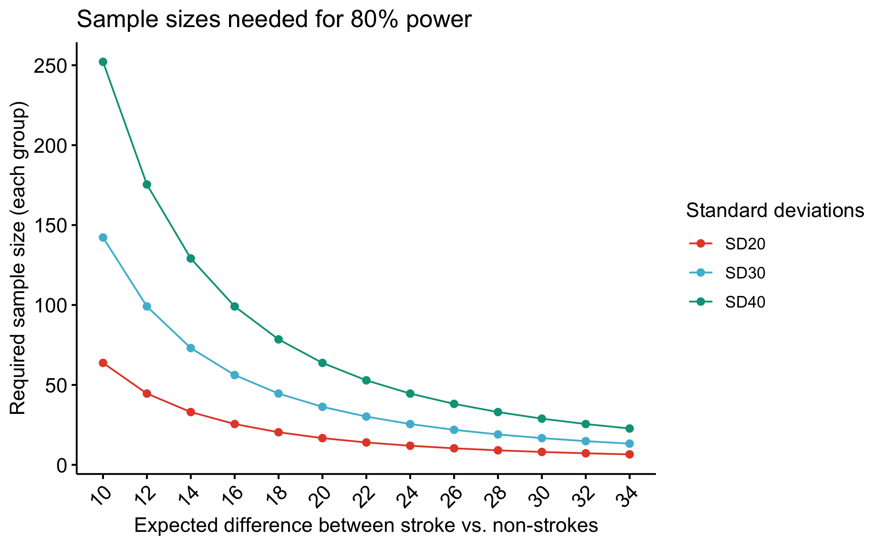

# Power calculation for stroke diagnosis in acute vertigo

We aim to discover biomarkers that differentiate strokes from non-strokes in acute vertigo patients at the emergency department. Given the differences in stroke risk and vertigo presentation of the sexes, we aim to discover sex-specific biomarkers. For this study we will include around 800 patients, and expect a drop-out of roughly 10%. Approximately 10% of the total sample size will be cases, _i.e._ patients with stroke.

To this end, we need to calculate the sample size needed to find a significant difference (p < 0.05) with a power of >80% between groups.

Earlier studies provide some insight in the expected differences between groups. For instance Kartal _et al._ reported on S100B for differential diagnosis of stroke in vertigo patients1.

The issue here is that we don't have means and standard deviations, we have medians and interquartile ranges. However, there are methods that can estimate means and standard deviations from a null distribution.

For instance: 
- http://bmcmedresmethodol.biomedcentral.com/articles/10.1186/1471-2288-14-135
- https://cran.r-project.org/web/packages/estmeansd/estmeansd.pdf and https://github.com/stmcg/estmeansd

The latter method is based on [MacGrath et al. 2020](https://journals.sagepub.com/doi/full/10.1177/0962280219889080), and available as an `R`-package, `estmeansd`. We can is easily implement this.

Based on this simulation and the Winner's curse that exists for small sized studies we conclude the following:

    "The expected difference between group is likely much smaller than the estimated delta of the mean of 31 based on Kartal _et al._; we expect it to be around 20 or smaller. Thus, for a power of >80%, with an expected total sample size of 720, a 10% case-rate, and to enable sex-stratified biomarker discovery, we would require 50-80 samples in each group."

**Figure 1. Power calculation.** 

#### Analysis Scripts

- *power_median.Rmd* 
R Notebook in `R markdown` that calculates power.
- *power_median.nb.html* 
R Notebook in `HTML` the compiled `R markdown` notebook for easy reading in any browser.

#### Notes
The code will work within the context of R version 4.0.4 (2018-12-20) -- 'Eggshell Igloo' with macOS Mojave (10.14.2). 

#### Versions

* v1.0.1 Fixed reference. Edit explanation.
* v1.0.0 Initial version.

#### References
1. [Kartal A.G. _et al._ Ac Em Med 2014](https://doi.org/10.1111/acem.12420).
--------------

#### The MIT License (MIT)
##### Copyright (c) 1979-present Sander W. van der Laan | s.w.vanderlaan [at] gmail [dot] com.

Permission is hereby granted, free of charge, to any person obtaining a copy of this software and associated documentation files (the "Software"), to deal in the Software without restriction, including without limitation the rights to use, copy, modify, merge, publish, distribute, sublicense, and/or sell copies of the Software, and to permit persons to whom the Software is furnished to do so, subject to the following conditions:   

The above copyright notice and this permission notice shall be included in all copies or substantial portions of the Software.

THE SOFTWARE IS PROVIDED "AS IS", WITHOUT WARRANTY OF ANY KIND, EXPRESS OR IMPLIED, INCLUDING BUT NOT LIMITED TO THE WARRANTIES OF MERCHANTABILITY, FITNESS FOR A PARTICULAR PURPOSE AND NONINFRINGEMENT. IN NO EVENT SHALL THE AUTHORS OR COPYRIGHT HOLDERS BE LIABLE FOR ANY CLAIM, DAMAGES OR OTHER LIABILITY, WHETHER IN AN ACTION OF CONTRACT, TORT OR OTHERWISE, ARISING FROM, OUT OF OR IN CONNECTION WITH THE SOFTWARE OR THE USE OR OTHER DEALINGS IN THE SOFTWARE.

Reference: http://opensource.org.

